# 🤖 AutoInsights: The Self-Correcting Enterprise Data Analyst

> **Capstone Project for the Google AI Agents Intensive (Enterprise Track)**


**AutoInsights** is an autonomous multi-agent system designed to bridge the **Data Latency Gap** in enterprises.  
It acts as an *on-demand data analyst*, transforming natural language questions into secure SQL queries, executing them, and generating executive-grade insights with visualizations — in seconds.

---

## 📖 Table of Contents
- [Project Summary](#-project-summary)
- [Architecture & Agents](#-architecture--agents)
- [Essential Tools](#-essential-tools)
- [Key Features](#-key-features)
- [Getting Started](#-getting-started)
- [Usage](#-usage)
- [Evaluation](#-evaluation)
- [Project Structure](#-project-structure)
- [Video Demo](#-video-demo)

---
## 🌟Flow Diagram

---

## 📋 Project Summary

| **Section** | **Description** |
|------------|------------------|
| **Problem Statement** | Non-technical managers struggle to extract insights from organizational data. Even answering *"Why did sales drop in Q3?"* requires analysts, SQL, and manual charts — creating bottlenecks and delays. |
| **Solution Overview** | AutoInsights democratizes analytics with a **Natural Language Interface** to your database. The system is a **multi-agent AI** that understands schema, writes secure SQL, validates logic, and **self-corrects errors** automatically. |

---

## 🏗️ Architecture & Agents

The system uses the **A2A (Agent-to-Agent) Protocol** to run a safe, sequential workflow with built-in feedback loops.

```mermaid
graph LR
    User[User Query] --> Architect[👷 Architect Agent]
    Architect -->|Generate SQL| Validator[🛡️ Validator Agent]
    Validator -->|Pass| Coder[💻 Coder Agent]
    Validator -->|"Fail (Loop)"| Architect
    Coder -->|Execute & Chart| Storyteller[📝 Storyteller Agent]
    Coder -->|"SQL Error (Loop)"| Architect
    Storyteller --> Final[📊 Final Report]
```



### 🧠 The Agent Team

| **Agent** | **Role** | **Function** |
|-----------|----------|--------------|
| **Architect** | The Brain | Creates schema-aware SQL using few-shot prompting; receives errors and auto-corrects queries. |
| **Validator** | The Safety Net | Reviews SQL for safety (no DROP/DELETE) and logical flaws before execution. |
| **Coder** | The Hands | Executes SQL in a secure sandbox and generates intelligent visualizations. |
| **Storyteller** | The Voice | Turns raw data + charts into clear business insights. |

---

## 🛠️ Essential Tools

| **Tool Name** | **Functionality** | **Key Feature** |
|---------------|-------------------|-----------------|
| **SQLExecutorTool** | Secure database SQL execution | Strict allow-listing of tables & safe error capture |
| **VisualizationTool** | Auto chart generator | Switches between line/bar plots based on data shape |
| **DatabaseMemory** | Schema/Context Manager | Injects table definitions into the agent context |

---

## 🌟 Key Features

- 🔄 **Self-Correction Loop:** Automatically fixes SQL errors without user involvement  
- 🛡️ **Enterprise Safety:** Allow-listed SQL and pre-execution validation  
- 📊 **Dynamic Visualization:** Auto-selects the best chart type using matplotlib  
- 🐳 **Docker Ready:** Plug-and-deploy to any cloud runtime  
- ⚡ **Powered by Gemini 2.5 Flash:** Sub-second reasoning for real-time analytics  

---

## 🚀 Getting Started

### **Prerequisites**
- Python 3.10+
- Google Cloud Project with Gemini API access

### **Installation**

#### 1️⃣ Clone the Repository
```bash
git clone https://github.com/anjanakri/Auto-Insights.git
cd Auto-Insights
```

#### 2️⃣ Create a Virtual Environment
```bash
python -m venv venv

# Windows
.\venv\Scripts\activate

# Mac/Linux
source venv/bin/activate
```

#### 3️⃣ Install Dependencies
```bash
pip install -r requirements.txt
```

#### 4️⃣ Add Environment Variables  
Create a `.env` file:

```env
GEMINI_API_KEY=your_google_api_key_here
```

---

## 💻 Usage

Run the main application:

```bash
python autoinsights_adk_python.py
```

### Example Output:
```
🚀 Starting Analysis: Why did sales drop in Q3?
--------------------------------------------------
🤖 Architect: Generated SQL (Attempt 1)
⚠️ Validator: Issues found. Looping back...
✅ Coder: Execution Successful!

📝 FINAL REPORT
SQL Used: SELECT * FROM sales...
```

---

## 🧪 Evaluation

Run the built-in evaluation suite:

```bash
python evaluate.py
```

This script executes multiple test cases and generates a pass/fail score for agent performance.

---

## 📂 Project Structure

```
AutoInsights/
├── src/
│   ├── agents/               # Architect, Coder, Validator, Storyteller
│   ├── tools/                # SQLExecutorTool, VisualizationTool
│   └── memory/               # Schema & DB Context Manager
├── Dockerfile                # Deployment Configuration
├── autoinsights_adk_python.py # Main App Entry Point
├── evaluate.py               # Agent Test Suite
├── requirements.txt          # Python Dependencies
└── README.md                 # Documentation
```

---

## 🎥 Output
📺 *Coming Soon*  


---

## 📄 License
This project is licensed under the **MIT License** — see the `LICENSE` file for details.
